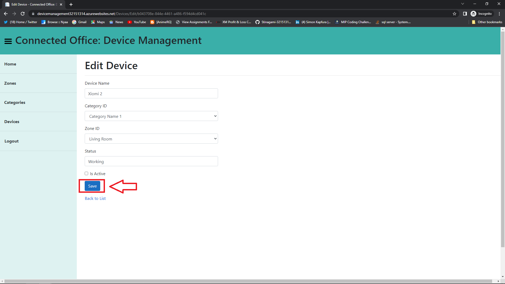

# Project 3 Read me
This ReadMe has all the information on how to use the Connected Office web app
available at: https://devicemanagement32151314.azurewebsites.net/

# Security:
- The image below shows what happens if someone tries to access any endpoint without being logged in:

- The web app will redirect to the login page and after loging in then they will see the contents of the endpoint

# Register:
- To Register a new account click on the "Register as a new user" hyper link as indicated in the image below

- Fill in all the required details to create a new account 

- Make sure that the information is correct and there are measures to ensure the information being entered is correct and valid

- After Entering the correct information you can click the "Register" button and procceed to the login Page

# Login:
- To login you have to enter the details you regidtered and you will be redirected to the Home page as the image below
- In the home page you can access the Devices, Categories and Zones of the Connected Office

# Zones:
- When you click "Zone" you will be redirected to the page containing all the zones available
- You have options to Add, Delete, and Edit the zones
- To create a new zone Click the button indicated in the image below

- Add the required Zone information then click "Create" as indicated in the image below

- The newly created Zone is now available
- You have 3 options  as indicated on the right side of the newly added zone:
  - Pen icon = Edit
  - Eye icon = View details
  - Bin icon = Delete

- Clicking the pen icon will redirect you to the page below where you can edit information of an Existing Zone
- Click "Save" After making relevant changes

- The changes made from the Edit can be seen take effect if successful as shown in the image bekow

- Clicking the eye icon will take you to the page shown below where you see information of a selected Zone

- Clicking the Bin icon will redirect to the delete Zone page as shown in the image below
- Click  the "Delete" button to remove the specified zone

- Image below shows that the deleted zone is no longer there

# Categories:
- When you click "Category" you will be redirected to the page containing all the categories available
- You have options to Add, Delete, and Edit the categories
- To create a new category Click the button indicated in the image below

- Add the required category information then click "Create" as indicated in the image below

- The newly created category is now available
- You have 3 options  as indicated on the right side of the newly added category:
  - Pen icon = Edit
  - Eye icon = View details
  - Bin icon = Delete

- Clicking the pen icon will redirect you to the page below where you can edit information of an Existing category
- Click "Save" After making relevant changes

- Clicking the eye icon will take you to the page shown below where you see information of a selected category

- Clicking the Bin icon will redirect to the delete category page as shown in the image below
- Click  the "Delete" button to remove the specified category

- Image below shows that the deleted category is no longer there

# Devices:
- When you click "Device" you will be redirected to the page containing all the Devices available
- You have options to Add, Delete, and Edit the Devices
- To create a new Device Click the button indicated in the image below

- Add the required Device information then click "Create" as indicated in the image below

- The newly created Device is now available
- You have 3 options  as indicated on the right side of the newly added Device:
  - Pen icon = Edit
  - Eye icon = View details
  - Bin icon = Delete

- Clicking the pen icon will redirect you to the page below where you can edit information of an Existing Device
- Click "Save" After making relevant changes

- Clicking the eye icon will take you to the page shown below where you see information of a selected Device

- Clicking the Bin icon will redirect to the delete Device page as shown in the image below
- Click  the "Delete" button to remove the specified Device

- Image below shows that the deleted Device is no longer there

